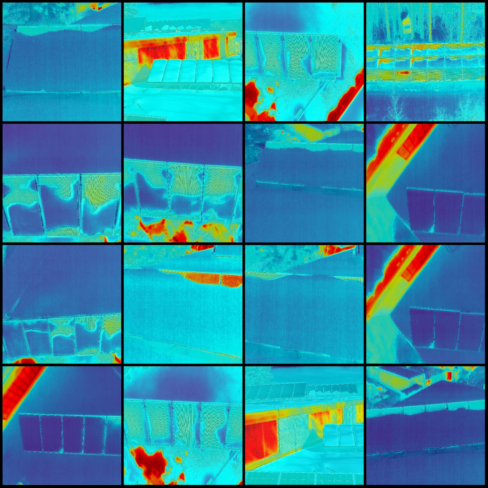
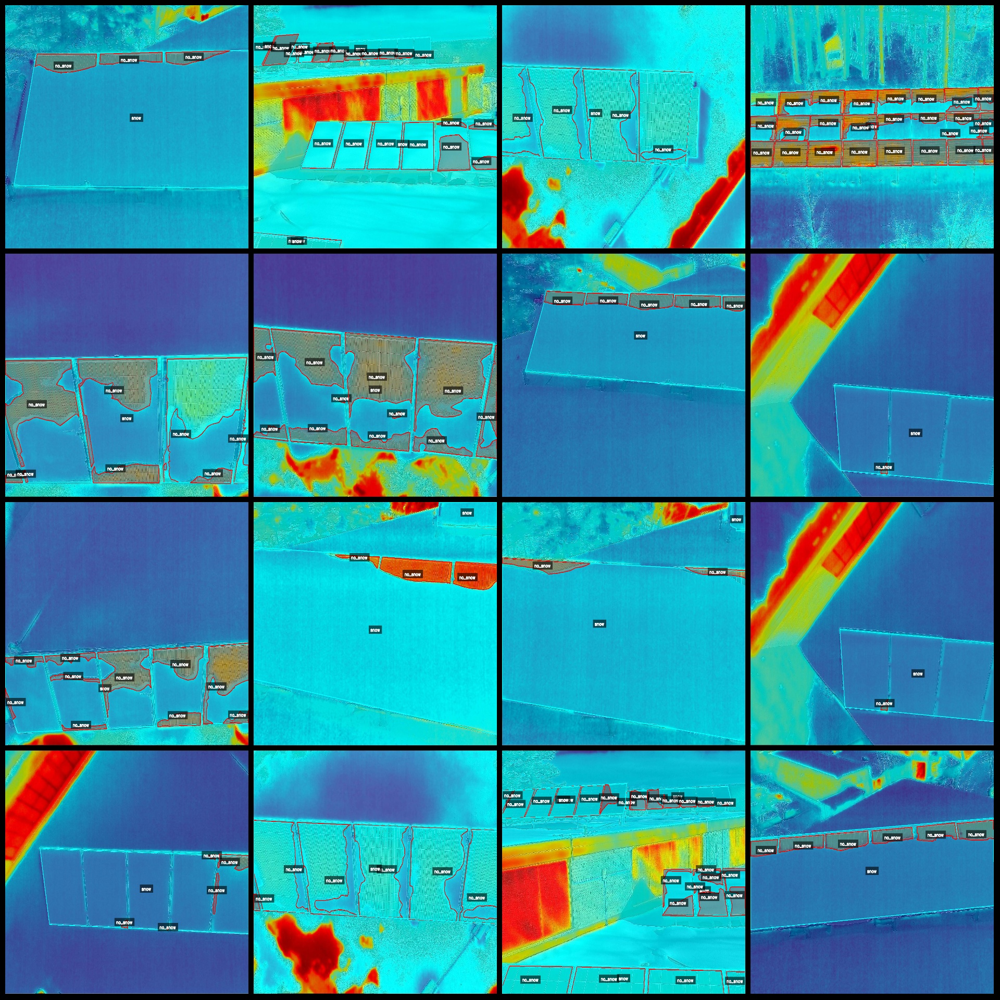
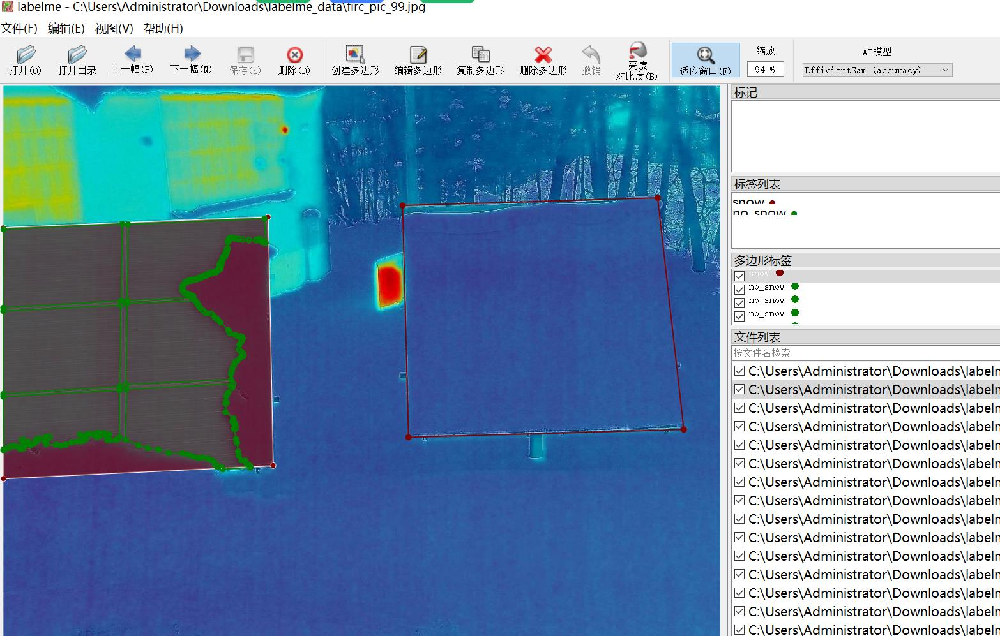

# Infrared Image Snow on Solar Panels Separation Dataset - labelme Format with 234 Images in 2 Categories

Dataset Format: labelme format (without mask files, only containing jpg images and corresponding json files)
Image Count: 234 jpg files
Annotation Count: 234
Annotation Category Count: 2
Annotation Category Names: ["no_snow", "snow"]
Each category's number of boxes:
no_snow count = 2510
snow count = 394
Total Boxes: 2904
Using Annotation Tool: labelme=5.5.0
Image Resolution: 1194x918
Annotation Rules: Polygon drawing for categories
Important Notice: The dataset can be edited using labelme, but the json dataset needs to be converted into either mask or yolo format or coco format for semantic segmentation or instance segmentation.
Special Remark: This dataset does not guarantee the accuracy of the trained models or weight files.
Image Preview:
Annotation Example:
Randomly selected 16 images:
Annotation drawing results:
Labelme editing image example:

## Images

Here is a pay link on Stripe ( https://buy.stripe.com/3cs8yP7sY87d0vu9AB ). Please contact me lonlonago@foxmail.com after funding $89, and I will send you a complete data files , thank you!

